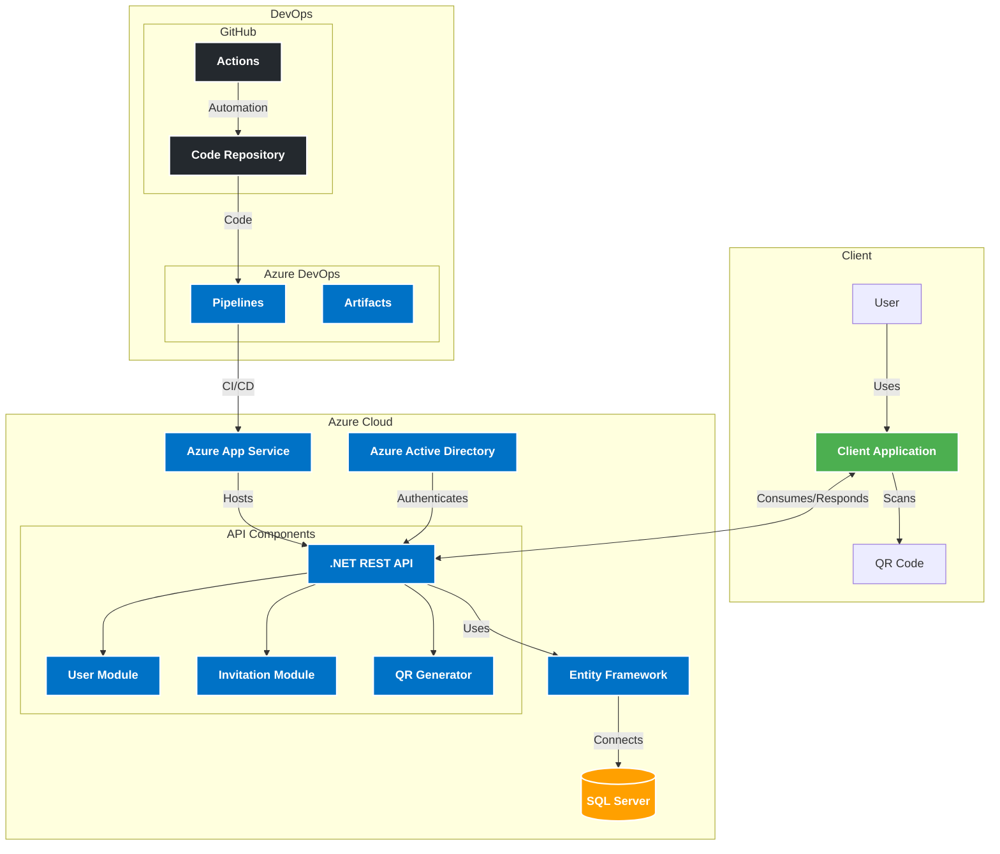

# CondoHub Auth Service

<div align="center">


[](https://sonarcloud.io/summary/new_code?id=osvalois_condohub-auth-service)

A robust authentication microservice for CondoHub, built with .NET 8 and Azure AD integration.
</div>

## Table of Contents

- [Overview](#overview)
- [Features](#features)
- [Architecture](#architecture)
- [Prerequisites](#prerequisites)
- [Getting Started](#getting-started)
- [Usage](#usage)
- [API Documentation](#api-documentation)
- [Infrastructure as Code](#infrastructure-as-code)
- [Testing](#testing)
- [Deployment](#deployment)
- [Contributing](#contributing)
- [License](#license)

## Overview

CondoHub Auth Service is a specialized authentication microservice designed for the CondoHub ecosystem. It provides secure user management and authentication capabilities, leveraging Azure Active Directory for robust identity management while offering flexibility for custom authentication flows.

## Features

- 🔐 Secure user authentication and authorization
- 👤 User registration and profile management
- 🔑 Password recovery functionality
- 🔄 Azure Active Directory integration
- 🚀 Built on .NET 8 for optimal performance
- 🏗️ Clean Architecture for maintainability and scalability
- 🌐 RESTful API design
- 📱 QR code generation for seamless mobile access

## Architecture

CondoHub Auth Service follows Clean Architecture principles, ensuring separation of concerns and maintainability. The system is composed of the following layers:

1. **API Layer**: Handles HTTP requests and responses
2. **Application Layer**: Contains business logic and use cases
3. **Domain Layer**: Defines core business entities and interfaces
4. **Infrastructure Layer**: Implements data access and external service integrations

### System Components



## Prerequisites

- [.NET 8 SDK](https://dotnet.microsoft.com/download/dotnet/8.0)
- [Azure CLI](https://docs.microsoft.com/en-us/cli/azure/install-azure-cli)
- [Terraform](https://www.terraform.io/downloads.html)
- [Docker](https://www.docker.com/get-started) (for containerization)

## Getting Started

### Installation

1. Clone the repository:
   ```sh
   git clone https://github.com/osvalois/condohub-auth-service.git
   cd condohub-auth-service
   ```

2. Restore dependencies:
   ```sh
   dotnet restore
   ```

3. Build the project:
   ```sh
   dotnet build
   ```

### Configuration

1. Set up your Azure AD application in the Azure portal.
2. Configure your `appsettings.json` with the necessary Azure AD settings and connection strings.
3. Create environment-specific `appsettings.{Environment}.json` files as needed.

## Usage

To run the service locally:

```sh
dotnet run --project src/AuthService.Api
```

The API will be available at `https://localhost:5001`.

## API Documentation

API documentation is available via Swagger UI when running the service in development mode. Access it at:

```
https://localhost:5001/swagger
```

### Key Endpoints

- `POST /api/auth/signup`: Register a new user
- `POST /api/auth/token`: Obtain an authentication token
- `POST /api/auth/recover`: Initiate password recovery
- `POST /api/auth/logout`: Log out a user
- `POST /api/qr/generate`: Generate a QR code for mobile access

For detailed API specifications, refer to the Swagger documentation when running the service.

## Infrastructure as Code

We use Terraform to manage our Azure infrastructure. The `infrastructure` directory contains all necessary Terraform scripts and a Makefile for easy management.

To set up the required resources:

1. Navigate to the infrastructure directory:
   ```sh
   cd infrastructure
   ```

2. Initialize Terraform:
   ```sh
   make init
   ```

3. Plan the infrastructure changes:
   ```sh
   make plan
   ```

4. Apply the changes:
   ```sh
   make apply
   ```

For more information on available commands, run `make help`.

## Testing

Run the test suite with:

```sh
dotnet test
```

We encourage writing unit tests for all new features and bug fixes.

## Deployment

Deployment is managed through Azure DevOps pipelines. The repository includes a Dockerfile for containerization of the service.

To deploy manually:

1. Build the Docker image:
   ```sh
   docker build -t condohub-auth-service .
   ```

2. Push the image to your container registry.

3. Deploy the image to Azure App Service using Azure CLI or Azure DevOps pipelines.

## Contributing

We welcome contributions to the CondoHub Auth Service! Please follow these steps to contribute:

1. Fork the repository
2. Create a new branch for your feature or bug fix
3. Make your changes and commit them with clear, descriptive messages
4. Push your changes to your fork
5. Create a pull request to the main repository

Please ensure your code adheres to the existing style and includes appropriate tests.

## License

This project is licensed under the MIT License - see the [LICENSE](LICENSE) file for details.

---

For any questions or support, please open an issue on the GitHub repository or contact the maintainers directly.